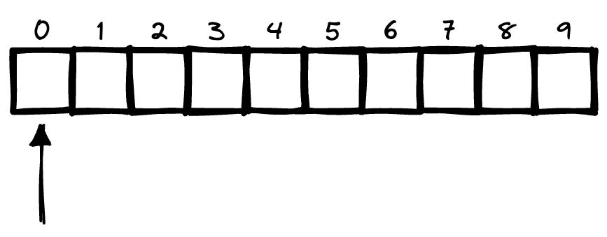
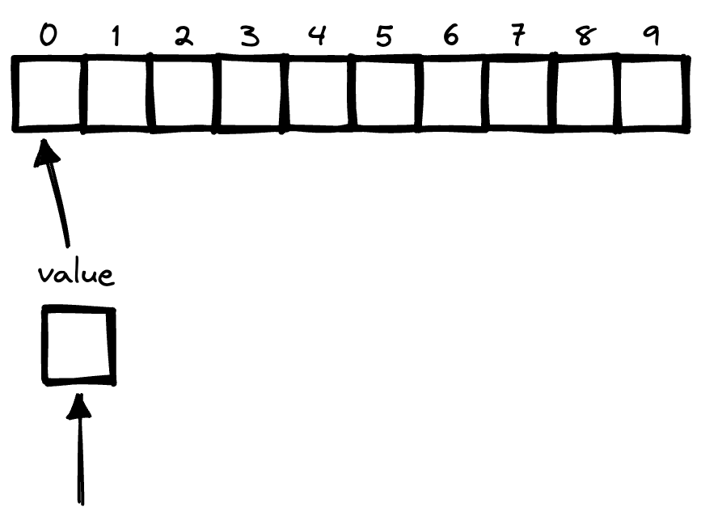

# 如果这样遍历一个迭代器会得到什么结果

本文中的迭代器只是对Slice/Map这类可迭代数据类型的总称，至于Go中是否有迭代器这一概念，有兴趣可以自己去了解。

## 思考一下

先来最基础的一个遍历Slice的代码。
```go
func main() {
	s := []int{1, 2, 3, 4, 5}
	for i, v := range s {
		fmt.Printf("index = %d; value = %d\n", i, v)
	}
}
```

我们再来给他加点东西看看。增加一个s2，将s1中每个元素的地址，append到s2中。

```go
func main() {
	s1 := []int{1, 2, 3, 4, 5}
	s2 := make([]*int, 0)
	for _, v := range s1 {
		s2 = append(s2, &v)
	}
	fmt.Printf("s2: %v\n", s2) // s2: [0x140000ac008 0x140000ac008 0x140000ac008 0x140000ac008 0x140000ac008]
}
```

可以看到，上述代码中，s2切片中，每个元素的值都是相等的，意味着都指向了同一个值，这显然不是我们所期望的结果。

来看下为什么会这样。

```go
func main() {
	s1 := []int{1, 2, 3, 4, 5}
	s2 := make([]*int, 0)
	for i, v := range s1 {
		fmt.Printf("&s1[%d]: %p\n", i, &s1[i])
		fmt.Printf("&v: %p\n", &v)
		fmt.Println()
		s2 = append(s2, &v)
	}
	fmt.Printf("s2: %v\n", s2)
}
```
> &s1[0]: 0x14000018120
> &v: 0x14000014118
> 
> &s1[1]: 0x14000018128
> &v: 0x14000014118
> 
> &s1[2]: 0x14000018130
> &v: 0x14000014118
> 
> &s1[3]: 0x14000018138
> &v: 0x14000014118
> 
> &s1[4]: 0x14000018140
> &v: 0x14000014118
>
> s2: [0x14000014118 0x14000014118 0x14000014118 0x14000014118 0x14000014118]

可以看到，实际上`v`变量的地址是不会随着迭代过程而发生改变的。

因此Go语言中此种方式的迭代，实际上是申请了两个变量`i`和`v`，并在迭代过程中，改变变量中的值，并不会开辟新的地址空间。


## 图解一下

**我之前认为的Go迭代器操作流程：**



迭代中会直接访问元素，因此每次获取到的都是不同的地址空间。


**然而，实际上迭代器的操作流程：**



通过`value`访问元素，从而遍历整个迭代器。因此过程中只会访问`value`，而不会直接访问元素。


## 结论

以上只举了Slice的例子，以此类推，其实在遍历Map的时候也会遇到相似的问题。

Go看似贴心的提供了多种遍历迭代器的方案，但实际上要是用的不小心，就会踩坑里去。

那么，我们该怎么更好的避免此类的问题呢？

下面提供几个参考的思路，当然最好的办法还是尽可能避免会产生这种问题的场景。

- 遍历迭代器时尽量避免直接取值的操作，可以通过索引（或者键）取值。
	```go
	for i := range s {
		v := s[i]
	}
	```

- 重新赋值一次（强制单独开辟一个变量空间）
	```go
	for _, v := range s {
		v := v
	}
	```


